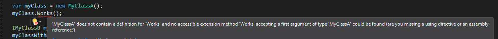
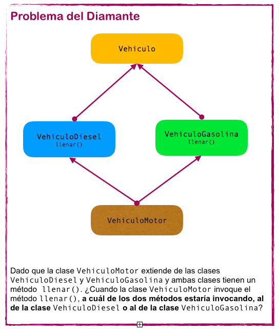

# Lo nuevo en C# 8.0 - Default Interface Methods

Con la llegada de `C# 8.0` nuestras inferfaces permiten incluir implementaciones genéricas para los métodos que declaran y poder ser compartidos entre las diferentes clases de implementación de la interfaz tal como se puede realizar con las clases abstractas.

Esta posibilidad nos brinda posibilidades totalmente nuevas como la de pensar en utilizar `Mixins`; pero también dudas sobre cuando utilizarlo y algún que otro dolor de cabeza al permitir una pseudo-multiherencia y apareciendo el `problema del diamante`.

> **Info:** No es algo novedozo, Java ya lo acepta desde la version 8 [link](https://www.geeksforgeeks.org/default-methods-java/)

## Implementación

### 1. Implementación básica

```csharp
public interface IMyClassA
{
    public void Works() => Console.WriteLine("Hello from InterfaceA");
}

public class MyClassA : IMyClassA {}

IMyClassA myClass = new MyClassA();
myClass.Works();
// -- output: Hello from InterfaceA
```

Notese que debemos tipificar el tipo de `myClass` a la interface porque si utilizamos `var` o `MyClassA` el compilador va a generar un error indicando que no encuentra `works()` en la clase.



Realmente no hay mucha diferencia con respecto a lo que podemos hacer con una clase abstracta hasta este momento no? 🙄

### 2. Extendiendo la interfaz y sobre-escribiendo el Default Method

¿Podemos extender la interfaz si sobre escribir el metodo default que creamos en `IMyClassA`? Totalmente SI! 🙌

```csharp
public interface IMyClassAOverride : IMyClassA
{
    public new void Works() => Console.WriteLine("Hello from IMyClassAOverride");
}
public class MyClassAOverride : IMyClassAOverride {}

IMyClassAOverride myClassAOverride = new MyClassAOverride();
myClassAOverride.Works();
// -- output: "Hello from IMyClassAOverride"
```

Pueden ver que al realizar el `override` del metodo `Works()` se esta utilizando el modificar `new` el cual hace que se oculte la implementación de base del metodo al que modifica ([documentación](https://docs.microsoft.com/en-us/dotnet/csharp/language-reference/keywords/new-modifier)).

También podemos sobre-escribirlo de la siguiente manera

```csharp
public interface IMyClassEOverride : IMyClassE
{
    void IMyClassE.Works()
    {
        Console.WriteLine("Hello from IMyClassEOverride");
    }
}
```

### 3. Implementando una interfaz con Default Methods y otra sin Default Methods

Puede pasar que tengamos una clase que implemente 2 interfaces que definen el mismo metodo `Works()` pero que una la implemente con Default Methods y la otra no... ¿Qué pasa en estos casos? ¿Reconoce que el método ya esta implementado o no?

```csharp
public interface IMyClassC
{
    void Works();
}

public class MyClassWithMutiInterfacesWithNoDefaults : IMyClassA, IMyClassC
{
    public void Works() => Console.WriteLine("Hello from MyClassWithMutiInterfacesWithNoDefaults");
}

// probemos tipificando con las diferentes posibilidades
MyClassWithMutiInterfacesWithNoDefaults myClassWithMutiInterfacesWithNoDefaults = new MyClassWithMutiInterfacesWithNoDefaults();
myClassWithMutiInterfacesWithNoDefaults.Works();
// -- output: Hello from MyClassWithMutiInterfacesWithNoDefaults

IMyClassA myClassWithMutiInterfacesWithNoDefaultA = new MyClassWithMutiInterfacesWithNoDefaults();
myClassWithMutiInterfacesWithNoDefaultA.Works();
// -- output: Hello from MyClassWithMutiInterfacesWithNoDefaults

IMyClassC myClassWithMutiInterfacesWithNoDefaultC = new MyClassWithMutiInterfacesWithNoDefaults();
myClassWithMutiInterfacesWithNoDefaultC.Works();
// -- output: Hello from MyClassWithMutiInterfacesWithNoDefaults
```

Pues no... nos solicita que implementemos el método y además, sea como sea que lo utilicemos, siempre ejecuta la versión del método sobreescrito.

### 4. ¿Que podemos hacer con propiedades?

Lamentablemente no mucho. No esta permitido tener un "estado" en la interfaz por lo que solo permite definir un valor por default al `getter/setter` y luego tocará sobre-escribirlo

```csharp
public interface IMyClassD
{
    public string Name {
        get {
            return "Andres";
        }
        private set { }
    }
}
```

En el ejemplo el `set` lo hice privado, pero unicamente para señalar que de esta forma se puede crear un valor constante o un valor default para todas las implementaciones

Referencias

* [Excelente y completísima explicación](https://www.infoq.com/articles/default-interface-methods-cs8/)
* [Microsoft C# 8 news](https://docs.microsoft.com/en-us/dotnet/csharp/whats-new/csharp-8#default-interface-methods)
* [Microsoft C# 8 proposal](https://docs.microsoft.com/en-us/dotnet/csharp/language-reference/proposals/csharp-8.0/default-interface-methods)
* [Microsof Update to Interface Methods](https://docs.microsoft.com/en-us/dotnet/csharp/tutorials/default-interface-methods-versions)


## Problema del Diamante

Como deciamos en un principio. el advenimiento de esta nueva funcionalidad en C# 8.0 trae la posibilidad de caer en el Problema del diamante tan temido cuando un lenguaje permite Multi-Herencia.

El problema del diamante plantea la exitencia de 2 o más clases (clase `A` y clase `B`) que implementan un mismo método, por ejemplo `Run()`, y otra clase `C` que extiende de ellas (es lo que permite la herencia múltiple), entonces, ¿cuál versión de `Run()` debe ser utilizada?

Hay varias estrategias para resolver este problem, como por ejemplo tomar la primer implementación que encuentra y descartar el resto.

Gráficamente se ilustra de la siguiente forma ([imagen obtenida de aquí](https://es.stackoverflow.com/questions/104165/por-qu%C3%A9-la-herencia-m%C3%BAltiple-no-se-admite-en-java)):


C# 8.0 y su Inteface Default Implementation aborda el problema desde el punto de las interfaces, o sea una clase va a presentar este problema si dos o mas de las interfaces que implementa tienen implementado el mismo método (ya vimos anteriormente que pasa si una de ellas lo declara y no lo implementa).

```csharp
public interface IMyClassA
{
    public void Works() => Console.WriteLine("Hello from InterfaceA");
}

public interface IMyClassB
{
    void Works() => Console.WriteLine("Hello from InterfaceB");
}

public class MyClassWithMultiInterfaces: IMyClassA, IMyClassB { }

IMyClassB myClassWithMultiInterfacesB = new MyClassWithMultiInterfaces(); // gets the more implicit Interface in multi-hieritance
myClassWithMultiInterfacesB.Works();
// -- output: Hello from InterfaceB

IMyClassA myClassWithMultiInterfacesA = new MyClassWithMultiInterfaces(); // gets the more implicit Interface in multi-hieritance
myClassWithMultiInterfacesA.Works();
// -- output: Hello from InterfaceA

MyClassWithMultiInterfaces myClassWithMultiInterfaces = new MyClassWithMultiInterfaces();
// myClassWithMultiInterfaces.Works(); <-- compilation error, pasa esto porque no sobreescribimos el método en la clase
```

Como podemos ver, C# 8.0 no toma mucha desición y deja al programador decidir. En este caso debemos tipificar la variable para que el compilador sepa cual implementación utilizar.

Realmente, en este momento, no se me ocurre algun caso real que pase esto... aunque aún es muy nuevo y ya llegarán los dolores de cabeza 😈😅

Referencias a herencia múltiple:

* [Wikipedia](https://es.wikipedia.org/wiki/Herencia_m%C3%BAltiple)
* [Pdf](https://ingenieria.udistrital.edu.co/pluginfile.php/39191/mod_resource/content/1/Herencia%20m%C3%BAtiple.pdf)
* [StackOverflow](https://es.stackoverflow.com/questions/104165/por-qu%C3%A9-la-herencia-m%C3%BAltiple-no-se-admite-en-java)

## Mixins

Un Mixin es una clase generada a partir de la unión de otras clases, o sea, la clase `A` define el método `Save()` y la clase `B` define el método `SaveAsync()`, por lo tanto la clase `C` que extiende a ambas es el resultado de la concatenación de todos los miembros de las clases que implementa. La clase resultante es el Mixin (también se les dice Mixin a las clases parciales base).

En el mundo de C# los Mixin no son tan conocidos, es más, si alguien nunca salió del mundo Microsoft talvez es la primera vez que escuche nombrar el concepto de Mixin, pero no es para nada nuevo. Es algo archi/hiper conocido en front end y mas precisamente en pre-procesador como Sass. Otros lenguajes como Python lo permiten de forma mativa o como Java que también lo permite con librerías de terceros o bien nativamente con Interface Default Methods como en C#.

Una de las bondades ques se dice sobre los Mixin es que permite extender la funcionalidad de muchas clases con un solo codigo (código escrito en un único lado) con solo hacer referencia que la clase depende de ésta.

Alguno podrá decir que es algo similar a las class extentions.... pues sí, en parte sí. Una de las diferencias que veo es que en este caso los mixin se verifican en tiempo de compilación y las class extentions pueden llegar a ser dinámicas si llegamos a cargar .dll de forma dinámica. Diferencia que en parte desaparece si usamos Proxies generados dinámicamente (las librerías de Mixin hace eso), pero el objeto que tendriamos sería un Proxy (como cuando utilizamos Moq en los test) y no el objeto real, aunque esta generación dinámica tiene su costo en los recursos en tiempo de ejecución cosa que los Default Methods no.

Veamos un ejemplo de una lamparita

Primero creamos la interfaz base y una clase base

```csharp
interface ILight
{
    protected enum STATUS
    {
        ON,
        OFF
    }

    protected STATUS Status { get; set; }

    public bool IsOn() => Status == STATUS.ON;

    public bool isOff() => Status == STATUS.OFF;

    public void SwitchOff() => Status = STATUS.OFF;

    public void SwitchOn() => Status = STATUS.ON;
}

public class BaseLight : ILight
{
    STATUS ILight.Status { get; set; } = STATUS.OFF;
}
```

Ahora creamos otras interfaces que extienden de `ILight` las cuales agregan funcionalidad nueva, una que permita tener un delay en el encendido/apagado y otra que permita tener lamparitas de colores

```csharp
interface ITimerLight : ILight
{
    public async void DelaySwithOff(int duration)
    {
        await Task.Delay(duration);
        SwitchOff();
    }

    public async void DelaySwithOn(int duration)
    {
        await Task.Delay(duration);
        SwitchOn();
    }
}

public interface IColoredLight : ILight
{
    public enum COLOR
    {
        RED,
        YELLOW,
        WHITE,
        BLUE
    }

    protected COLOR SelectedColor { get; set; }

    public void SetColor(COLOR value) => SelectedColor = value;
}
```

Ahora podemos crear cualquier cantidad de objetos unicamente ensamblando los diferentes componentes

```csharp
// Lamparita básica
public class SimpleLight : BaseLight { }

// Lamparita con delay
public class TimerLight : BaseLight, ITimerLight { }

// Lamparita con varias funcionalidades
public class CrazyLight : BaseLight, ITimerLight, IColoredLight
{
    COLOR IColoredLight.SelectedColor { get; set; } = COLOR.WHITE;
}
```

Finalmente las utilizamos de la siguiente manera

```csharp
ILight light = new SimpleLight();
light.SwitchOn();
light.SwitchOff();

ITimerLight timerLight = new TimerLight();
timerLight.DelaySwithOn(1);
timerLight.DelaySwithOff(2);

CrazyLight crazyLight = new CrazyLight();
((IColoredLight)crazyLight).SetColor(COLOR.RED);
((ITimerLight)crazyLight).DelaySwithOn(1);
```

Por lo que veo, la posibilidad del Mixin está pero creo que entro como de costado... como consecuencia de las Default Methods y el equipo que se encarga del update del lenguaje creo que tiene muchas posibilidades para desarrollar Mixins de una manera mucho mas amigable hacia el programador como por ejemplo que no se tenga que castear a cada interfaz para utilziar cada método.

Referencias

* [Wikipedia](https://es.wikipedia.org/wiki/Mixin)
* [Microsoft](https://docs.microsoft.com/en-us/dotnet/csharp/tutorials/mixins-with-default-interface-methods)
* [Ejmplo Python - recomendado](https://pythonista.io/cursos/py111/mixins)
* [Ejemplo Java](https://www.arquitecturajava.com/java-mixins-un-ejemplo-sencillo/)
* [CSS SASS](https://css-tricks.com/custom-user-mixins/)

## Conclución

Creo que es una nueva funcionalidad que abre la puerta a nuevas formas de diseñar y pensar una aplicación desde el diseño básico, buscando nuevos patrones de reutilización de lógica de negocio y código; abriendo la posibilidad a herencia múltiple y uso de Mixins pero no lo veo 100% como algo cerrado.

La imposibilidad de utiliar `var` o la clase al declarar la variable y utilizar los métodos definidos en la intefaz hace que sea engorroso tener que castearlo cada vez, más allá que lleva a un overhead de tener que conocer mucho más en profundidad todas las clases ya que no el IDE no te auto-completa con esos métodos si no casteas a la interfaz correcta (ni hablar si tenes mas de una interfaz).

Por lo pronto, creo que no es una funcionalidad que la utilice mucho en un proyecto de producción. ¿Qué piensan ustedes?
