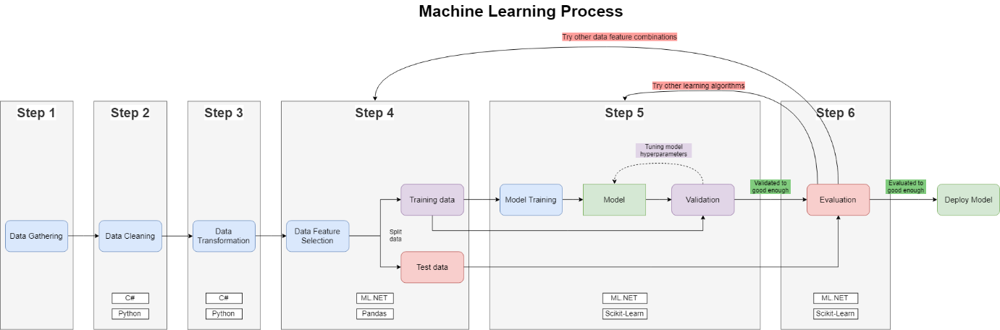

# Machine Learning en .Net (a.k.a ML.Net)

> MachineLearning: Se traduce al castellano como "Aprendizaje Automático" y es una subrama de la Inteligencia Artificial (IA).

**Nota**: Esta sección no intenta ser un manual de Machine Learning ni nada similar sino simplemente es la bajada a escrito de cierto conocimeinto propio y de las ganas de seguir aprendiendo sobre ML y en específico que se puede hacer con ML.Net. Puede que pueda servir de guía/orientación para quien recien comienza en este sub-mundo y se encuentra perdido con tantos conceptos nuevos y no comprenda bien por donde comenzar. Al final se listan links a mejores referencias.

**Nota 2**: ¿Hay que saber mucha matemática para comenzar?
La verdad que no es imprescindible pero si hay que tener ganas y voluntad para aprender. Por ejemplo, sabes que es un [Hiperplano](https://es.wikipedia.org/wiki/Hiperplano)? o talvez conozcas que hay mas de la forma clásica que nos enseñan en la escuela en medir dos puntos en el plano que es la fórmula de la distancia euclidea (d(x, y) = √(y1 - x1)² + (y2 - y2)²), sino que existen otras fórmulas como la [Distancia Manhattan o Taxicab](https://en.wikipedia.org/wiki/Taxicab_geometry) o la [Distancia de Chebyshov](https://es.wikipedia.org/wiki/Distancia_de_Chebyshov).

## Machine Learning
[[En desarrollo]]

El Machine Learning nos permite "enseñar cosas" a una pc (o mejor dicho a un sistema informático) y que luego nos pueda "recomendar o sugerir" una solución o consecuencia a partir de una nueva situacion en base a los ejemplos enseñados previamente.

De lo anterior surgen varios puntos a profundizar:

* La pc aprende: En realidad no aprende como una persona sino que se le brinda un conjunto de hechos y por medio de una proceso informático (algoritmo) genera un modelo interno que representa los hechos con los que se entrenó.
* Recomienda/sugiere: es exactamente eso. Una vez que el sistema tiene un modelo basado en el entrenamiento recibido se le pueden presentar nuevas situaciones desconocidas para que las evalue. Estas situaciones serán evaluadas con el modelo y generará una respuesta con un cierto nivel de verdad. Cuanto mas detallado, mayor la cantidad de ejemplos y mejor calidad de la muenstra durante el entrenamiento, mas certera será la respuesta.
* Ejemplos: es la base del conocimiento del sistema y desde los cuales se obtienen/extraen los conceptos para el modelo-
* Concepto: conjunto de objetos que comparten ciertas propiedades que los diferencian de otros conceptos (por ejemplo, concepto mesa y concepto silla que puedan ser diferenciados al analizar una imagen)

### Pero ¿Cómo podemos estar seguros y decir que un sistema aprende?

Veamos esto con un ejemplo:

Digamos que el sistema de alguna forma aprendió 2 conceptos y los sabe reconocer al analizar una imágen. Estos dos conceptos son:

* una silla
* un perro

Excelente, el sistema tiene el modelo y empezamos a procesar imagenes de sillas y perros por separado y el sistema reconoce perfectamente cuando se trata de una silla o de un perro.

Ahora bien, queremos procesar una imagen que tiene una silla con patas bajas y además por algun motivo ajeno a nosotros el tapizado tiene un color marrón y es muy peludo... ¿Con que nivel de presición nuestro modelo entenderá que es una silla y no un perro? Esta es una situación donde vemos si el sistema puede reconocer nuevos patrones y categorizarlos correctamente y efectivamente, aprendió.

Cabe recalcar que un sistema aprende mejor o peor dependiendo de la calidad de los ejemplos utilizados durante el entrenamiento.

Por otro lado, porque un sistema pueda reconocer sillas y perros, no significa que al no poder entender correctamente si el ejemplo anterior es una silla o un perro este mal. Talvez simplemente no es un caso que se pueda dar en la realidad del uso de nuestro sistema y ese nivel de error es aceptable para nosotros.

### Diferencia con la Inteligencia Artificial

[[En desarrollo]]

### Diferencia con el Deep Learning 

[[En desarrollo]]

## Diferencia con Data Mining

[[En desarrollo]]

## Categorización

[[En desarrollo]]

## Proceso
[[En desarrollo]]

Para que un conjunto de datos/información/etc llege a ser modelado por el sistema de Machine Learning debe pasar por un proceso de estandarización y entrenamiento.

Por lo general, toda la literatura sigue un lineamiento similar en cuanto a la división de pasos del proceso:

1) Obtener los datos (archivos físicos, streaming, etc que pueden provenir de multiples fuentes, como log de una BD o HTTP Server, banco de imágenes, sensores IOT lo que fuere)
2) Limpieza los datos (por ejemplo si es un log en csv, eliminar las columnas que no nos interesan)
3) Tarnsformación de los datos (ej, dejar multiples archivos de log en un mismo formato)
4) Split de datos en datos para entrenar y datos para testear
5) Entrenar el modelo
6) Evaluar el modelo

Un ejemplo mas gráfico y que personalmente me gusta como lo representa y con el agregado de que indica que paso se puede realizar desde ML.Net es el siguiente:

|  |
|:--:|
|*source [link](https://strongminds.dk/artikler/how-to-preprocess-data-for-machine-learning-in-net-and-python/)*|

# Herramientas

Por lo general cuando se habla de Machine Learning se habla de Python, en este caso vamos voy a hacer las pruebas tanto en c# usando _**ML.Net**_ como en python. La idea es aprender _Machine Learning_ independientemente del lenguaje, pero utilizando herramientas/librerías que mas se utilizan en el mercado, python en este caso y por gusto propio y porque veo un gran potencial, la librería de _Microsoft_.

Necesitamos algo instalado? Bueno si. Necesitamos python y algo para graficar. Lo mas conocido y utilizado (hasta donde yo se) son las [Jupyter Notebooks](https://jupyter.org), el cual permite en un mismo documento, agregar código ejecutable, Markdown, plotear gráficos, etc.

Para estos ejemplos, voy a utilizar [Anaconda](https://www.anaconda.com/), que vendría a ser una distribución de _Jupyter_ con un monton de añadidos.

Podemos instarlar _Anaconda_ en nuestra PC, pero la verdad que prefieron mantener mi PC libre de software y poder re-instalar los entornos rápidamente en cualquier PC por lo que _Docker_ nos va a dar una mano. Perderemos la interfaz sencilla de instalar plugins de _Anaconda_, pero por el momento no sera un problema.

En este mismo repositorio pueden encontrar el `docker-compose` para dejar _Anaconda_ funcionando con Python y Net Core, simplemente tipeando

```bash
docker-compose up -build
```

Lo único malo es que la imagen necesita alrededor de 2GB y tarda un rato en realizar todos los updates. Si quieren agilizar la instalación pueden comentar las lineas donde se actualiza el conda.


# ML.Net

[[En desarrollo]]

ML.Net nos permite agregar capacidad de Machine Learning a nuestras aplicaciones .Net (Net Core y Net Framework) utilizando un modelo previamente entrenado.

Una forma de hacer esto, es tener una "aplicación de entrenamiento" que genere el modelo dejándolo en una ubicación que la aplicación cliente (quien va a utilizar el modelo) lo pueda acceder y cargar.

## Ejemplo básico
[[En desarrollo]]

## Regresión líneal
[[En desarrollo]]

### La matemática de las regreciones
[[En desarrollo]]

### Ejemplo ML.Net
[[En desarrollo]]

### Ejemplo Python
[[En desarrollo]]

# Literatura y links

Libros

1) Sistemas Inteligentes - García Martinez - Servente - Pasquini
2) Inteligencia Colectiva - Toby Segaran

Links - Teoria

1) [Formulas de distancia](https://studylib.es/doc/4622569/medidas-de-distancia)
2) [El juicio Pitágoras](https://elpais.com/elpais/2016/10/18/el_aleph/1476813443_840074.html)
3) [Wikipedia - Aprendizaje automático](https://es.wikipedia.org/wiki/Aprendizaje_autom%C3%A1tico)
4) [Machine Learning](https://www.interactivechaos.com/manual/tutorial-de-machine-learning/presentacion)
5) [Proceso de Machine Learning](https://towardsdatascience.com/the-7-steps-of-machine-learning-2877d7e5548e)
6) [Glosario Machine Learning](https://yanndubs.github.io/machine-learning-glossary/)

Links - ML.Net

1) https://xamlbrewer.wordpress.com/2019/05/07/machine-learning-with-ml-net-in-uwp-binary-classification/
